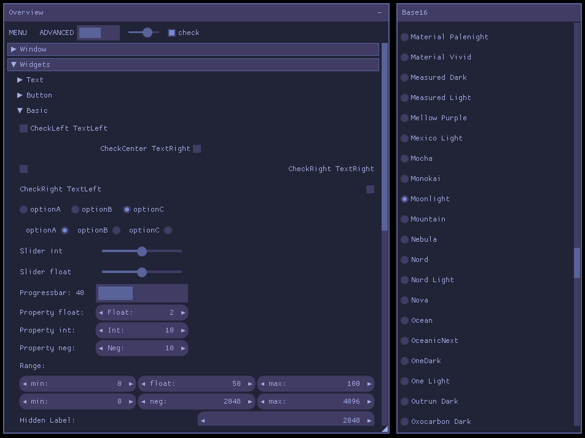

# nuklear_base16

[Base16](https://github.com/tinted-theming/home) styles for [Nuklear](https://github.com/Immediate-Mode-UI/Nuklear). Over 200 color styles to apply to your Nuklear GUI.

## Screenshot



## Usage

``` c
#define NK_BASE16_IMPLEMENTATION
#include "nuklear_base16.h"

nuklear_base16_set_scheme(ctx, base16_tomorrow_night);
```

## Dependencies

- C or C++
- [base16-h](https://github.com/robloach/base16-h) C Headers for Base16
- [Nuklear](https://github.com/Immediate-Mode-UI/Nuklear) GUI

## License

[MIT](LICENSE)
